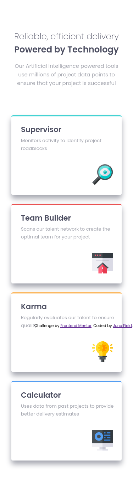
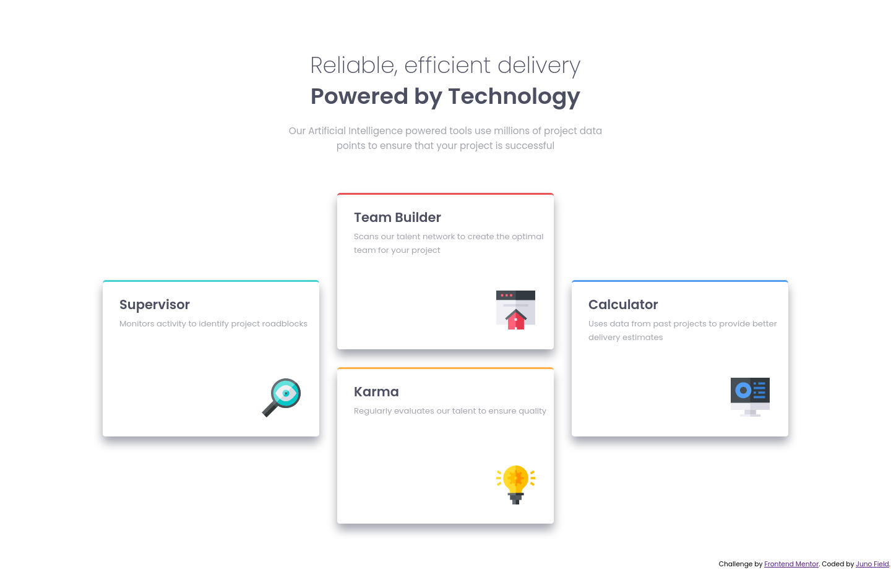

# Frontend Mentor - Four card feature section solution

This is a solution to the [Four card feature section challenge on Frontend Mentor](https://www.frontendmentor.io/challenges/four-card-feature-section-weK1eFYK). Frontend Mentor challenges help you improve your coding skills by building realistic projects. 

## Table of contents

- [Overview](#overview)
  - [The challenge](#the-challenge)
  - [Screenshot](#screenshot)
  - [Links](#links)
- [My process](#my-process)
  - [Built with](#built-with)
  - [Continued development](#continued-development)
- [Author](#author)

## Overview

### The challenge

Users should be able to:

- View the optimal layout for the site depending on their device's screen size

### Screenshot

*Note that the attribution is not displayed incorrectly as it is in the screenshot - it remains at the bottom of the page.*

### Links

- Solution URL: [https://github.com/JunoField/fm7-four-card-feature-section](https://github.com/JunoField/fm7-four-card-feature-section)
- Live Site URL: [http://junofield.github.io/fm7-four-card-feature-section](http://junofield.github.io/fm7-four-card-feature-section)

## My process

### Built with

- Semantic HTML5 markup
- CSS custom properties
- Mobile-first workflow
- Grid and flexbox
- [SASS](https://sass-lang.com/) - CSS extension framework
- [Parcel](https://parceljs.org/) - Provides testing server, build tools, etc.

### Continued development

The shadows around the boxes are not 100% correct - this will need improvement in future projects, as it is a very common feature of modern sites.

### Author

- GitHub - [JunoField](https://github.com/JunoField)
- Frontend Mentor - [@JunoField](https://www.frontendmentor.io/profile/JunoField)
